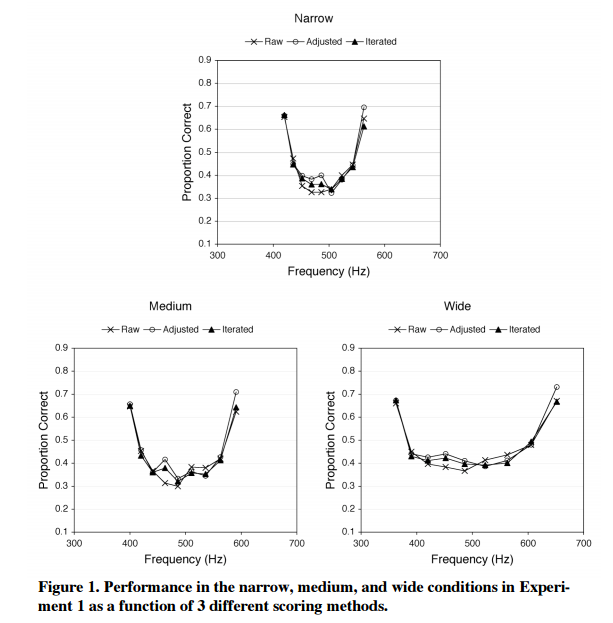

# A Guessing Model for Scale-invariance in Absolute Identification Tasks

### Background on Absolute Identification

> Lots of research in cognitive psychology has focused on whether there is a fundamental limit on people's capacity to process information and, if so, what that limit is. It might often seem that we have almost unlimited potential, especially when it comes to identifying and recognizing different items. Think of all the different people you can identify, or cars, or animals, or buildings, or pieces of furniture. Given the ease with which all of these items can be identified, it comes as a surprise to most people to find that when items vary in just one dimension, they cannot identify even seven items. The research that demonstrates this limitation is often done using a procedure known as absolute identification.
>
> In a typical absolute identification experiment, people are exposed to a set of stimuli that vary systematically along only one dimension (e.g., nine tones of different frequencies, or eight lines of different lengths). A label, often a digit, is associated with each stimulus. The task is simply to produce the correct label in response to the presentation of an item from the set.
>
> When the items are evenly spaced, the first and last items in the series are identified most easily. In contrast, identification of the middle items is usually quite poor. Such effects are found for many dimensions, including frequency, loudness, weight, area, line length, and semantic continua.
>
> -- <cite>https://coglab.cengage.com/labs/absolute_identification.shtml</cite>

One of the striking findings in absolute identification tasks is *scale invariance*. You might reasonably think that the task described above would be easier if there were larger gaps between the stimuli. For example, absolute identification of the lines on the left might be easier than identification of the lines on the right.

However, this turns out to not be the case! Performance on the task is similar regardless of how distinctive the stimuli are. Neath and Brown (2005) demonstrated this using different pitches in an auditory absolute identification task. Here are their data (ignore the different scoring methods):

Notice how in each of the three plots, the stimuli occupy different ranges of the frequency spectrum, with the top plot having tightly clustered pitches and the bottom right plot being more spread out. Across each plot, performance is roughly the same.

There's another striking feature of performance, which is that identification is substantially better for the lowest and highest pitches.

So, to summarize, there are two empirical results that we want to capture in a model of what people are doing.

1. Performance is the same regardless of how distinctive the stimuli are.
2. Performance is best for stimuli at the edges of the space.

What kind of model can account for these results?

### The guessing model

Neath and Brown (2005) describe a really simple algorithm that produces both results. It relies on the fact that in absolute identification tasks, the participant is given feedback after each guess. If you, as the participant, guess that the pitch you heard was Pitch 6, then you are told immediately after the guess that you were either correct or wrong. If you are wrong, then you are told the correct answer.

Here's what Neath and Brown proposed:

1. Assume that people have perfect *relative* judgment. They can always tell with perfect accuracy whether the pitch they just heard was higher or lower than the last one that they heard. While people may not actually have perfect relative judgment, relative judgments are generally very good so this is a reasonable simplification.
2. Randomly guess from the set of possible pitches, with the constraint that the random guess satisfies the relative difference. For example: If a person knows that they heard pitch 6 on the previous trial and also can perceive that the current pitch is higher than the previous pitch, they should randomly guess between pitches 7, 8, and 9 (if there are 9 different pitches).

Your job is to implement this model. There is some starter code for you in the `absolute-guessing-model.R` file. Modify that file to generate your solution.

### References

Neath, I., & Brown, G. D. A. (2005). Scale Invariance and Primacy and Recency Effects in an Absolute Identification Task. *Memory Lab Technical Report 2005-01, Purdue University.*
