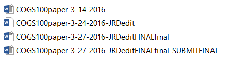
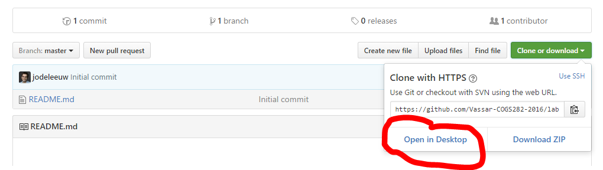
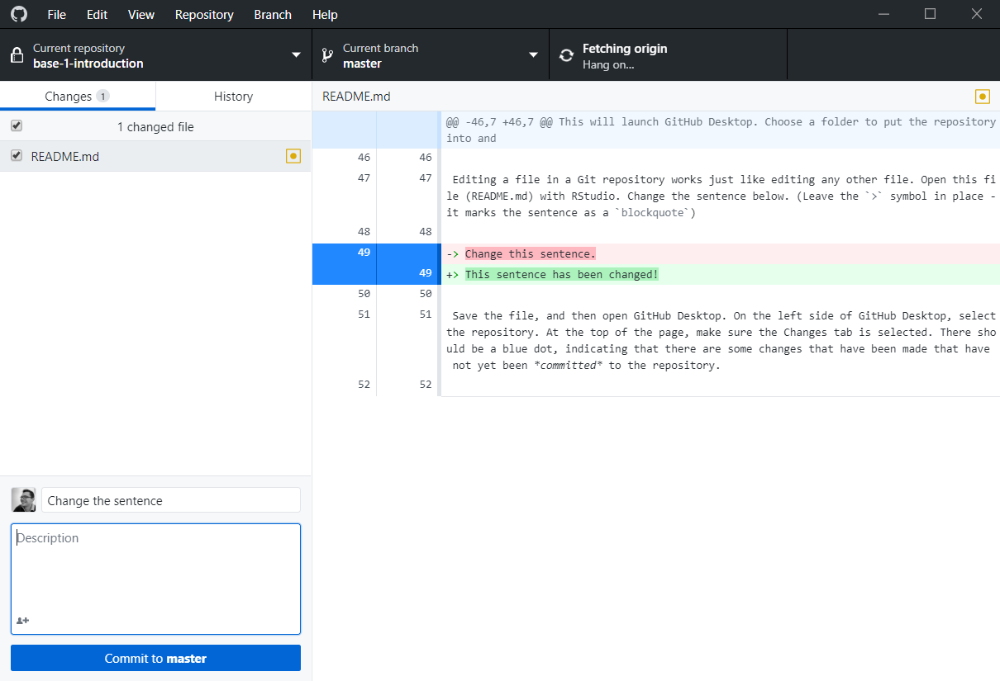

# Lab 1: Introduction to R, RStudio, and GitHub

#### Goals for this lab
- [ ] Learn how to use GitHub to get and submit assignments.
- [ ] Get acquainted with RStudio.
- [ ] Learn some R programming by building your first model.

## Part 1: GitHub

Have you ever done this?

Version control is the solution to this problem. Git is software for version control. Software like Git keeps track
of all the changes that you make to a document, so that you can go back to any
version at any time. GitHub is a website that makes using Git really easy.

Version control is especially important when building software, because it is
inevitable that, at some point, a change will be made that breaks the software.
Version control is also helpful because it makes collaborating easy.

### 1.1. Install GitHub Desktop

GitHub Desktop is a software program that you can install on your computer to make interacting with GitHub (the website) easier. If you are working on assignments on your own computer, then go to [desktop.github.com](http://desktop.github.com) and follow the instructions there to install it.

### 1.2. Downloading an assignment (forking)

*This is a review of what we did at the start of the lab, for your reference.*

Assignments in this class will be posted as GitHub repositories. Sometimes the
repositories will contain only a set of instructions, but often they will include
some data or code.

There are two different ways that a repository is downloaded from GitHub. If you are an administrator of the repository, then you can simply download a copy. If you are not an administrator, then you can *fork* the repository. *Forking* creates your own copy of the repository that you own and can modify as you wish. (It's
called forking because each copy of the repository will follow its own path.)

In this class, you can get an assignment by clicking the assignment link on Moodle. This will automate the forking process for you. The assignment repository will be forked to a new repository that you own. Once you have forked the repository, you can download it by going to the repository's page on github.com. The URL will be given to you during the forking process, and will also be accessible from the main [github.com](http://github.com) page when you log in - there's a list of repositories you can contribute to on the right hand side of the page.

Once you are on the repository page, click the big green "Clone or Download" button on the right side of the page, near the top. If you've got GitHub Desktop installed (part 1.1), you can choose "Open in Desktop" for the easiest method of getting a copy.

This will launch GitHub Desktop. Choose a folder to put the repository into and then let GitHub Desktop do the rest. You've now downloaded the assignment.

### 1.3. Editing the assignment

Editing a file in a Git repository works just like editing any other file. Open this file (README.md) with RStudio. Change the sentence below. (Leave the `>` symbol in place - it marks the sentence as a `blockquote`)

> Hello, it's me

Save the file, and then open GitHub Desktop. Select the repository in the top left corner. You should see a list of files that have been changed that have not yet been *committed* to the repository.

If you click on a file in this view, the right side of the screen will display the changes that were made to that file.

At the bottom-left of the window, there is a place to enter a summary and message. This is where you describe what changes you made in this *commit*. The summary should be short, but descriptive. You can optionally add a longer description of the changes.

Once you have added a summary message, you can click *commit to master*.

At this point your changes are part of the repository on your own computer, but they haven't been copied to GitHub yet. Click the sync button in the top right corner to synchronize the GitHub repository with your own copy.

You now know how to use the basics of GitHub. There are many other features that you can take advantage of. If you are interested, it takes about 20 minutes to work through [GitHub's own tutorial](https://guides.github.com/activities/hello-world/), where you will learn more about *branches* and *pull requests*. However, you probably won't need these features for this class.

## Part 2: RStudio

In this class we are going to use R for the majority of the modeling that we do.  [RStudio](www.rstudio.org) is a free IDE (integrated development environment) for writing code in R. You can install it on your own machine by going to their website and downloading it. You have to install R separately from the [R website](https://ftp.ussg.iu.edu/CRAN/).

One of the features of RStudio is a project management system. An RStudio project is a
way of grouping together R files so that references between files (like loading a data file) work seamlessly. RStudio project files have the `.Rproj` extension. There's already a project file created for this lab inside the `Lab1-Part3` folder. If you open that (double click), RStudio should automatically launch.

**Important**: For every lab, there will be an R Project file. Make sure that you always open the project file, either by launching RStudio by double-clicking the project file, or by selecting File > Open Project in RStudio. If you don't open the project file, then R will not correctly configure the *working directory* for your code, which will create errors when code depends on other files like data or other scripts.

## Part 3: R (and your first model)

In this repository, open the `Lab1-Part3` folder. You'll find an RStudio project called `Lab1-Part3`. Open the project (if you haven't already). Then, in the files section of RStudio, click on `R-intro.R` to start part 3. Some parts of this file are meant as a reference for you to use. There are also many questions embedded in the file where you should write code for practice.

Once you have worked through the `R-intro.R` file, you should read the `absolute-guessing-readme.md` file, located in the same directory. This is a markdown (.md) file, which is a simple markup language for formatting text files. If you open the file on GitHub's website, the formatting will display and you'll be able to see the included images. After reading through this introduction, you'll build your first model for this class in the `absolute-guessing-model.R` file.

## Submitting the assignment

To submit the lab, you need to create a *release* on GitHub. A release is just a frozen snapshot of the code. Creating a release is easy, and the [GitHub documentation walks you through the process](https://help.github.com/articles/creating-releases/).

Once you have created a release, copy the link to that release and submit the URL on Moodle under the appropriate assignment.
